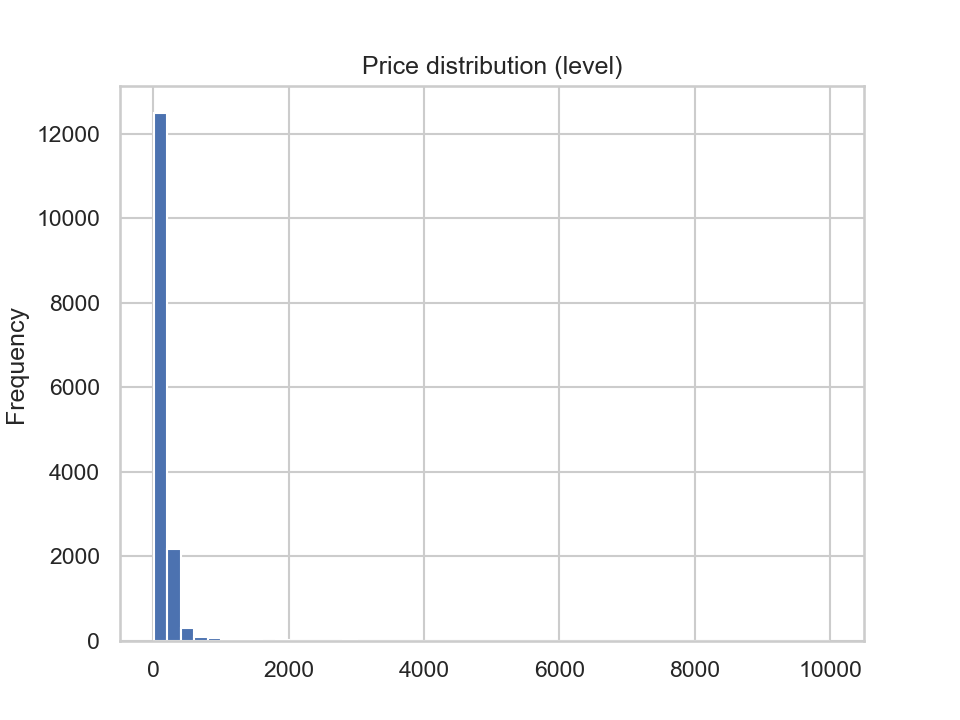
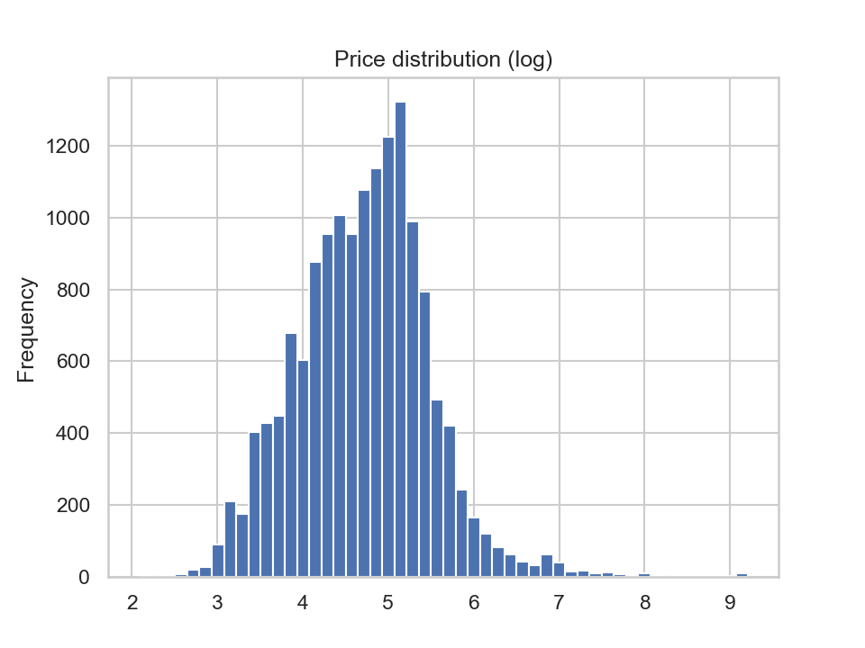
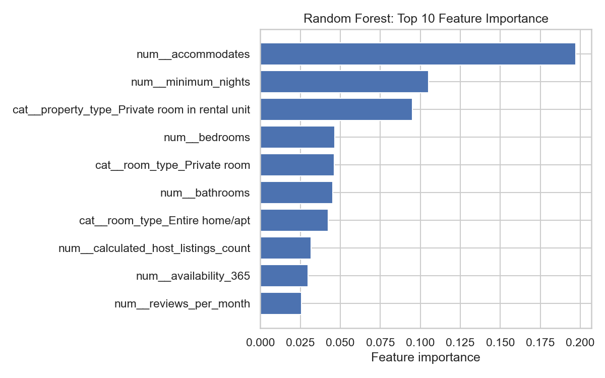
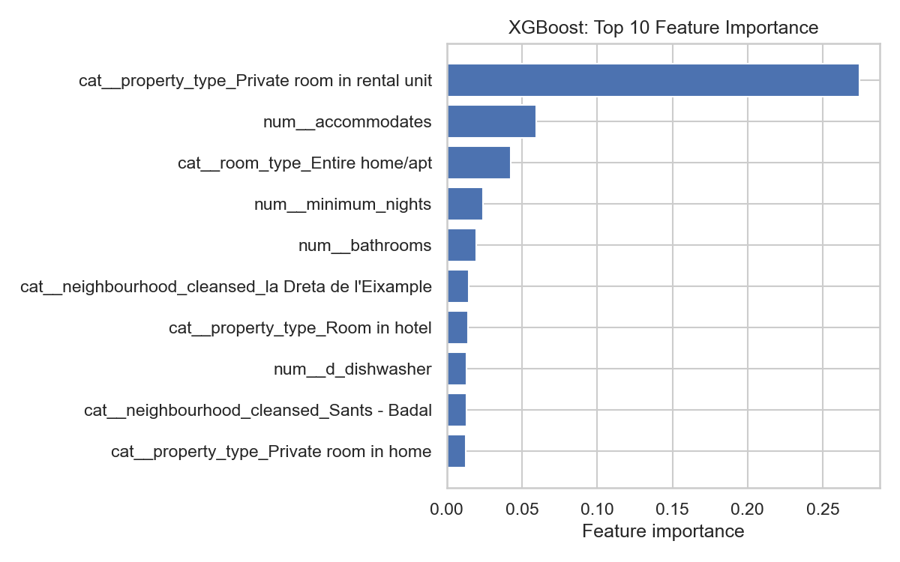

# Assignment 1 – Airbnb Pricing Models  
**Course:** Data Analysis 3 – Prediction and Introduction to Machine Learning  
**Student:** Sabira Onbayeva

---

## 1. Business Case

The business objective of this assignment is to operate a chain of Airbnb listings and develop a pricing model that predicts prices based on listing characteristics.

Using publicly available Inside Airbnb data, I build and compare multiple predictive models to understand which approaches best capture price dynamics and how well they generalize across time and location.

---

## 2. Data

### Data Sources

All datasets are obtained from [Inside Airbnb](https://insideairbnb.com).

**Core dataset** (training and main evaluation):
- City: Barcelona, Spain  
- Snapshot: Q1 2025  
- Observations: ~19,000 listings  
- URL:  
  https://data.insideairbnb.com/spain/catalonia/barcelona/2025-03-05/data/listings.csv.gz  

**Validity datasets:**
- Barcelona Q3 2025 (later date – time validity)
- Sevilla Q3 2025 (other city – geographic validity)

These additional datasets are used to assess robustness of the models across time and space.

All data is downloaded programmatically within the notebook to ensure reproducibility.

---
## Note on Reproducibility and Environment Setup

All results in this assignment can be reproduced on another machine using the provided code and environment specification.

### Software Environment

The computing environment is defined in the file `environment.yml`, which specifies:
- Python version
- All required packages (e.g., pandas, numpy, scikit-learn, xgboost, matplotlib)
- Compatible package versions

---

### Reproducing the Analysis

To reproduce the results on a new machine:

1. Clone the repository
   ```bash
   git clone <repository-url>
   cd Data-Analysis-3
   ```
2. Create and activate the conda environment
   ```bash
   conda env create -f environment.yml
   conda activate da3-airbnb
   ```
3. Launch Jupyter and run the analysis in `assignment1_airbnb_barcelona.ipynb`

---

## PART 1
## 3. Data Overview and Initial Inspection

After loading the Barcelona Q1 2025 dataset, I inspected:
- dataset dimensions
- variable types
- missing values

The raw dataset contains 79 variables, including numeric, categorical, and text-based fields. Many variables exhibit missing values, particularly review-related variables and host descriptions, which is typical for Airbnb data.

A missingness summary was created to identify variables requiring cleaning or imputation.

After review, I decided on the following data preparation strategy:

1. **Target handling:** observations with missing `price` must be removed, since the target cannot be imputed reliably. In the Barcelona Q1 2025 dataset, approximately 21% of listings have missing prices.
2. **Predictor missing values:** missing values in numeric and categorical predictors are handled using imputation within the preprocessing pipeline (median for numeric variables and most-frequent category for categorical variables).
3. **Text-heavy fields:** variables such as descriptions, host bios, and neighborhood overview fields are not essential for the predictive modeling and are not used.
4. **Amenities:** the `amenities` field has no missing values and can be transformed into structured binary indicators, so it is used for feature engineering.

### Log transformation of the target variable (price)

Airbnb prices exhibit a strong right-skewed distribution, driven by a small number of high-end or large-capacity listings. To address this skewness and stabilize the variance of the target variable, the natural logarithm of price is used for modeling. This allows us to reduce the influence of extreme price values and improves numerical stability for linear models. Using a log-transformed target also improves comparability across time and across cities, which is particularly important for the validity analysis conducted in Part II.

Histograms of the raw price and log-transformed price confirm that the log transformation produces a more symmetric and well-behaved distribution.




## 4. Predictor Groups

Predictors are grouped based on economic intuition and data availability:

**Numeric predictors**
- accommodates
- bedrooms
- beds
- bathrooms
- minimum_nights
- availability_365
- number_of_reviews
- reviews_per_month
- calculated_host_listings_count

**Categorical predictors**
- room_type
- property_type
- neighbourhood_cleansed

**Review score predictors**
- review_scores_rating
- review_scores_accuracy
- review_scores_cleanliness
- review_scores_checkin
- review_scores_communication
- review_scores_location
- review_scores_value

---
## 5. Train–Holdout Split

To evaluate model performance in an unbiased manner, the core dataset (Barcelona Q1 2025) is divided into a training set and a holdout test set.

- **Training set:** 80% of observations; used to fit all models and perform hyperparameter tuning  
- **Holdout set:** 20% of observations; used exclusively for out-of-sample evaluation and model comparison  

The holdout set is never used during model training or tuning.

---

## 6. Models

Five predictive models are estimated:

1. Ordinary Least Squares (OLS)
2. LASSO
3. Random Forest (hyperparameters tuned via cross-validation)
4. XGBoost   
    - Gradient boosting model with limited hyperparameter tuning to balance performance and computation time.
5. CART (Regression Tree)
   - Single decision tree with cost-complexity pruning.

All models predict log price and are evaluated on the same holdout set.

Models are compared using:
- RMSE (log price)
- R-squared (R²)
- Training time

The table below summarizes the results.
<div>
<style scoped>
    .dataframe tbody tr th:only-of-type {
        vertical-align: middle;
    }

    .dataframe tbody tr th {
        vertical-align: top;
    }

    .dataframe thead th {
        text-align: right;
    }
</style>
<table border="1" class="dataframe">
  <thead>
    <tr style="text-align: right;">
      <th></th>
      <th>Model</th>
      <th>RMSE (log)</th>
      <th>R²</th>
      <th>Fit time (sec)</th>
    </tr>
  </thead>
  <tbody>
    <tr>
      <th>0</th>
      <td>XGBoost</td>
      <td>0.371287</td>
      <td>0.760472</td>
      <td>41.612090</td>
    </tr>
    <tr>
      <th>1</th>
      <td>Random Forest</td>
      <td>0.372910</td>
      <td>0.758374</td>
      <td>196.111955</td>
    </tr>
    <tr>
      <th>2</th>
      <td>LASSO</td>
      <td>0.445202</td>
      <td>0.655610</td>
      <td>6.251894</td>
    </tr>
    <tr>
      <th>3</th>
      <td>OLS</td>
      <td>0.447101</td>
      <td>0.652666</td>
      <td>0.181748</td>
    </tr>
    <tr>
      <th>4</th>
      <td>CART</td>
      <td>0.489461</td>
      <td>0.583732</td>
      <td>21.186269</td>
    </tr>
  </tbody>
</table>
</div>

Tree-based ensemble models clearly outperform linear approaches. XGBoost achieves the lowest RMSE and highest R², closely followed by Random Forest. While their predictive accuracy is similar, XGBoost is substantially faster to train, making it more computationally efficient in this setting.

Linear models (OLS and LASSO) perform noticeably worse, indicating that Airbnb pricing relationships are highly non-linear and involve complex interactions that linear specifications cannot fully capture. LASSO offers only a marginal improvement over OLS despite regularization.

The CART model performs worst among all approaches. As a single decision tree, it lacks the variance-reduction and flexibility of ensemble methods, leading to underfitting and weaker predictive performance.

## Comparison of Random Forest and XGBoost

### Feature Importance 

For both models, feature importance is extracted using the built-in importance measures provided by the fitted estimators. These measures reflect how much each feature contributes to reducing prediction error across the ensemble.

Feature importance is computed after preprocessing, meaning that categorical variables expanded via one-hot encoding appear as individual features. The analysis focuses on the top 10 most important features for each model.

### Random Forest 


The Random Forest model identifies listing capacity as the most important driver of price. Variables such as the number of accommodates, bedrooms, and bathrooms rank highest, followed by room type and property type indicators. Several amenity indicators also appear among the top features.

Importance is relatively spread across multiple correlated predictors. 

### XGBoost 


XGBoost assigns high importance to a smaller set of predictors. In addition to listing capacity, specific room and property type indicators play a dominant role. Location-related features and selected amenities also appear among the most influential variables.

Compared to Random Forest, XGBoost concentrates importance more strongly on the most informative features. 

Both models largely agree on the key drivers of Airbnb prices: listing size, accommodation type, location, and quality-related features. However, their importance profiles differ in structure. Random Forest spreads importance across many predictors, while XGBoost focuses on fewer, highly predictive variables.

---

## PART 2
## 7. Validity Analysis

The purpose is to assess the robustness and external validity of the pricing models developed in Part I. This is done by evaluating model performance on two new “live” datasets:

- **A. Barcelona Q3 2025** – a later snapshot of the same city (time validity) ~ 15K listings  
- **B. Sevilla Q3 2025** – a different city in the same country (geographic validity) ~7K lisitngs

Both datasets are processed using the same data wrangling and feature engineering steps as the baseline dataset.

The following table summarizes model performance on the base dataset and the two validity datasets:

| Model         | RMSE Base | RMSE A (BCN Q3) | RMSE B (Sevilla) | ΔRMSE A | ΔRMSE B |
|---------------|-----------|------------------|------------------|---------|---------|
| XGBoost       | 0.3713    | 0.4091           | 0.5731           | +0.038  | +0.202  |
| Random Forest | 0.3729    | 0.3944           | 0.5832           | +0.021  | +0.210  |
| LASSO         | 0.4452    | 0.5049           | 0.5800           | +0.060  | +0.135  |
| OLS           | 0.4471    | 0.5055           | 0.5810           | +0.058  | +0.134  |
| CART          | 0.4895    | 0.4934           | 0.6718           | +0.004  | +0.182  |


A:  
All models experience some deterioration in performance when applied to the later Barcelona dataset. This is expected, as Airbnb markets are subject to seasonality, regulatory changes, and shifts in supply and demand.

Tree-based ensemble models (Random Forest and XGBoost) show relatively small increases in RMSE, indicating strong robustness over time. Linear models degrade more substantially. Interestingly, CART shows almost no change in RMSE. However, this most likely reflects its generally weak baseline performance rather than superior robustness.

B:  
Applying the models to Sevilla leads to a pronounced drop in predictive performance for all approaches. This highlights the limited transferability of pricing models trained on one city to another, even within the same country. Differences in neighborhood structure, tourist demand, and price levels are likely to reduce the relevance of Barcelona-trained relationships for Sevilla listings.

Despite this, ensemble models remain the strongest performers. Random Forest and XGBoost still outperform linear models and CART, indicating that flexible, non-linear methods generalize better across locations, even when absolute performance declines.

The validity analysis highlights two key findings:

1. **Time validity is relatively strong** within the same city. Models trained on Barcelona data remain useful several months later, especially ensemble methods.
2. **Geographic validity is limited.** Models trained in one city perform poorly when applied to another, even within the same country.

---

## 8. Conclusion

The results from Part I show that non-linear models substantially outperform linear ones in predicting nightly prices. In particular, Random Forest and XGBoost achieve the highest predictive accuracy, reflecting their ability to capture complex interactions between features. XGBoost delivers comparable accuracy to Random Forest at significantly lower computational cost, making it an attractive choice for practical implementation.

Feature importance analysis confirms that listing capacity, accommodation type, and location are the dominant drivers of price formation, with amenities and review quality playing secondary but meaningful roles. While both Random Forest and XGBoost identify similar key predictors, their importance profiles differ in structure, consistent with their underlying learning mechanisms.

Part II highlights important validity considerations. Models generalize reasonably well over time within the same city, with ensemble methods showing the strongest robustness. In contrast, geographic transferability is limited: models trained on Barcelona data perform substantially worse when applied to Sevilla. 
